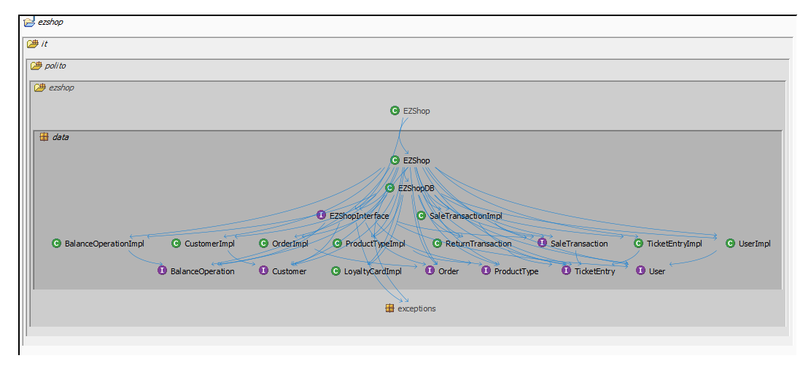
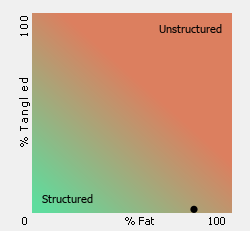
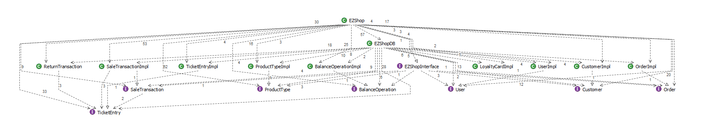

# Design assessment

Authors:  Biasi Cristina 281936, Cielo Fabio 292464, Guarnieri Enea 292561, Martini Miriana 283238

Date: 04/06/2021

Version: 1.0

# Levelized structure map

# Structural over complexity chart

# Size metrics

| Metric                                    | Measure |
| ----------------------------------------- | ------- |
| Packages                                  | 5       |
| Classes (outer)                           | 39      |
| Classes (all)                             | 39      |
| NI (number of bytecode instructions)      | 7686    |
| LOC (non comment non blank lines of code) | ~3305   |

# Items with XS

| Item     | Tangled | Fat  | Size | XS   |
| -------- | ------- | ---- | ---- | ---- |
| EZShopDB | 0       | 205  | 2435 | 1009 |
| EZShop   | 0       | 220  | 4244 | 1929 |

# Package level tangles

# Summary analysis

The main differences between the design delivered on April 30 and the current structure are: 

-  class Position, which implemented the coordinates of a Product Type in the inventory, has been removed and the information is stored in ProductType class itself; 
- class CreditCardCircuit has been removed since payments with credit cards are handled with a file (CreditCard.txt); 
- class Employee has been removed;
- class ProductInSale has been renamed in TicketEntry. ArrayLists of TicketEntry objects are defined both in SaleTransaction and ReturnTransaction classes to store informations about products purchased or returned;
- class EZShopDB has been defined to implement the interactions with the database and the persistency of data;
- class FinancialTransaction has been renamed in BalanceOperation;
- classes SaleTransaction, ReturnTransaction and Order don't extend class BalanceOperation, but simply refer to a balance operation with an integer value (the id).

The current structure shows a weakness in the fatness of classes EZShop and EZShopDB. This problem can be fixed implementing in different classes the interactions with different tables of the DB (ex: EZShopDBUser, EZShopDBProductType, ecc.). In this way also the size of the class would benefit.
