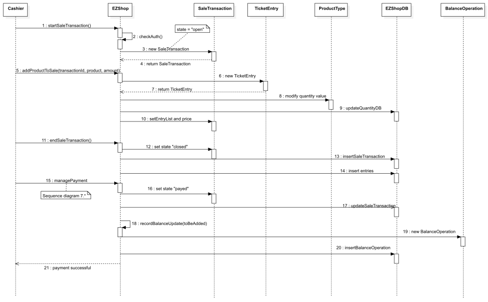

# Design Document 

Authors:  Biasi Cristina 281936, Cielo Fabio 292464, Guarnieri Enea 292561, Martini Miriana 283238

Date: 30/04/2021

Version: 1.0

Version: 1.1 - 26/05/2021 
Low level design and Verification Sequence diagrams modified after coding and testing

Version: 1.2 - 04/05/2021 
High level design and Verification Traceability matrix modified after coding and testing

Version 2.0 - 12/06/2021
Changes in document due to the implementation of Change Request - Add RFID on each product

# Contents

- [High level design](#package-diagram)
- [Low level design](#class-diagram)
- [Verification traceability matrix](#verification-traceability-matrix)
- [Verification sequence diagrams](#verification-sequence-diagrams)

# Instructions

The design must satisfy the Official Requirements document, notably functional and non functional requirements

# High level design 

The Architecture Pattern choosen is MVC (Model View Controller). 
The EZShopGUI package implements the View, while EZShopData package is related to Model and Data. 
An additional EZShopException package manages exceptions that can be throwned by EZShop.

### Package diagram

# Low level design

The Design Pattern adopted is the Façade.
EZShop class implements the EZShop interface, calls methods of all other classes and contains all data structures needed to manage the application.

### Class diagram

# Verification traceability matrix

|  | EZShop  | EZShopDB | User | ProductType | Order | BalanceOperation | Customer | LoyaltyCard | SaleTransaction | TicketEntry | ReturnTransaction |
| ------------- | :-------------:| :-------------:| :-------------:| :-------------:| :-------------:| :-------------:| :-------------:| :-------------:| :-------------:| :-------------: | :-------------: |
| FR1  | X | X | X |   |   |   |   |   |   |   |   |
| FR3  | X | X | X | X |   |   |   |   |   |   |   |
| FR4  | X | X | X | X | X | X |  |   |   |   |   |
| FR5  | X | X | X |   |   |   | X | X |   |   |   |
| FR6  | X | X | X | X |   | X | X | X | X | X | X |
| FR7  | X | X | X |   |   | X |   |   | X |   | X |
| FR8  | X | X | X |   | X | X |   |   | X |   | X |

# Verification sequence diagrams 

### SD1.1 - Scenario 1.1 Create product type X

### SD1.2 - Scenario 1.2 Modify product type location

### SD1.3 - Scenario 1.3 Modify product type price per unit

### SD2.1 - Scenario 2.1 Create user and define rights

### SD2.2 - Scenario 2.2 Delete user

### SD2.3 - Scenario 2.3 Modify user rights

### SD3.1 - Scenario 3.1 Order of product type X issued

### SD3.2 - Scenario 3.2 Order of product type X payed

### SD3.3 - Scenario 3.3 Record order of product type X arrival

### SD4.1 - Scenario 4.1 Create customer record

### SD4.2 - Scenario 4.2 Attach Loyalty card to customer record

### SD4.3 - Scenario 4.3 Detach Loyalty card from customer record

### SD4.4 - Scenario 4.4 Update customer record

### SD5.1 - Scenario 5.1 Login

### SD5.2 - Scenario 5.2 Logout

### SD6.1 - Scenario 6.1 Sale of product type X completed

### SD6.2 - Scenario 6.2 Sale of product type X with product discount

### SD6.3 - Scenario 6.3 Sale of product type X with product discount

### SD6.5 - Scenario 6.5 Sale of product type X cancelled

### SD7.1 - Scenario 7.1 Manage payment by valid credit card

### SD7.2 - Scenario 7.2 Manage payment by invalid credit card

### SD7.3 - Scenario 7.3 Manage credit card payment with not enough credit

### SD7.4 - Scenario 7.4 Manage cash payment 

### SD8.1 - Scenario 8.1 Return transaction of product type X completed, credit card

### SD9.1 - Scenario 9.1 List credits and debits

### SD10.1 - Scenario 10.1 Return payment by credit card

### SD10.2 - Scenario 10.2 Return cash payment 

