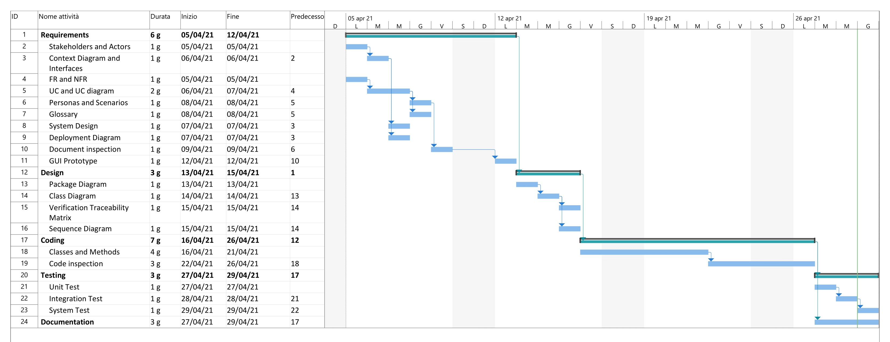

# Project Estimation  
Authors:  Biasi Cristina 281936, Cielo Fabio 292464, Guarnieri Enea 292561, Martini Miriana 283238

Date: 30/04/2021

Version: 1.0

# Contents
- [Estimate by product decomposition]
- [Estimate by activity decomposition ]
# Estimation approach
We use a Waterfall approach

# Estimate by product decomposition
### 
|             | Estimate                        |             
| ----------- | ------------------------------- |  
| NC =  Estimated number of classes to be developed   | 15 |             
|  A = Estimated average size per class, in LOC       | 100 | 
| S = Estimated size of project, in LOC (= NC * A) | 1500 |
| E = Estimated effort, in person hours (here use productivity 10 LOC per person hour)  | 150 |   
| C = Estimated cost, in euro (here use 1 person hour cost = 30 euro) | 4500 | 
| Estimated calendar time, in calendar weeks (Assume team of 4 people, 8 hours per day, 5 days per week ) | 1 week |               
# Estimate by activity decomposition
### 
|         Activity name    | Estimated effort (person hours)   |             
| ----------- | ------------------------------- | 
| Requirements | 85 | 2 persone - 6 giorni
| Design | 40 | 2 persone - 3 giorni
| Coding | 150 | 4 persone - 1 settimana
| Testing | 90 | 4 persone - 3 giorni
| Documentation | 25 | 1 persona - 3 giorni
### Gantt Chart

