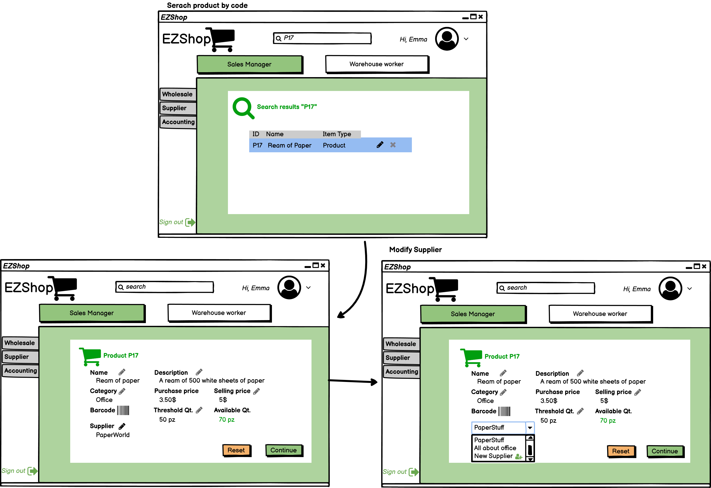

# Graphical User Interface Prototype  

Authors: Biasi Cristina 281936, Cielo Fabio 292464, Guarnieri Enea 	292561, Martini Miriana 283238

Date: 21/04/2021

Version: 1.0

## Use Case 1, 2, 3 (FR7 Manager Users)

#### Scenario 1.1 - Create an account for a new Cashier

### Scenario 2.1 - Modify User Account role from Cashier and Warehouse Worker to only Warehouse worker

### Scenario 3.1 - Delete an account

## Use Case 4, 5 (FR5 Manage Wholesale Customers, FR1.1 Create wholesales)

### Scenario 4.1 - Search a specific Wholesale Customer by name and list all his orders

### Scenario 5.1 - Create an order for a new wholesale customer who wants some products delivered every month

## Use Case 6, 7 (FR3 Manage Supplies)

### Scenario 6.1 - Update Supplier for a product

### Scenario 7.1 - Creation of an order for a supplier including products notified to be insufficient

## Use Case 8, (FR4.1 Modify an order's state)

### Scenario 8.2 - Modify Order's state for an outgoing order

## Use Case 9, (FR8 Support Accounting)

### Scenario 9.1 - Show report of revenues and expenditures in the last month for a certain product category 

## Use Case 10, (FR2 Manage Inventory)

### Scenario 10.1 - Insert new product

## Use Case 11, (FR6 Manage Retail Customers) 
### Scenario 11.1
Includes also update and delete of a Retail Customer

### FR6.6 List all purchases of a given retail customer

## Use Case 12, (FR1.2 Create Retail Sale)
### Includes Scenarios 12.1, 12.2 and 12.3
