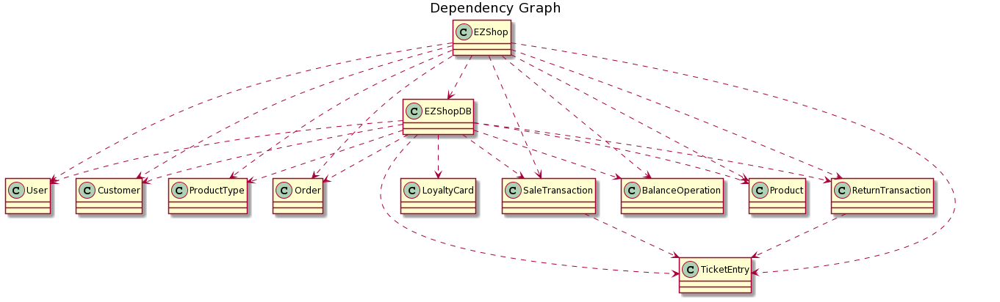

# Integration and API Test Documentation

Authors: Biasi Cristina 281936, Cielo Fabio 292464, Guarnieri Enea 292561, Martini Miriana 283238

Date: 26/05/2021

Version: 1.0

Version: 1.1 - 04/06/2021 Minor changes in Integration approach, Tests tables and Coverage of scenarios and FR

Version 2.0 - 12/06/2021
Changes in document due to the implementation of Change Request - Add RFID on each product

# Contents

- [Dependency graph](#dependency graph)

- [Integration approach](#integration)

- [Tests](#tests)

- [Scenarios](#scenarios)

- [Coverage of scenarios and FR](#scenario-coverage)
- [Coverage of non-functional requirements](#nfr-coverage)

# Dependency graph 

     
# Integration approach

The integration sequence adopted is bottom-up. In the Unit Testing phase we tested classes with no significant dependencies (User, Customer, Order, ProductType, Product, BalanceOperation, LoyaltyCard, SaleTransaction, ReturnTransaction, TicketEntry); then we tested the integration of EZShopDB class with these classes; finally we tested the EZShop class and its methods, and their dependencies.

#  Tests

 

## Step 1
| Classes  | JUnit test cases |
|--|--|
| UserImpl | *package UnitTest*  - TestUser.testUser()|
| CustomerImpl | *package UnitTest*  - TestCustomer.testCustomer()|
| LoyaltyCardImpl | *package UnitTest*  - TestLoyaltyCard.testLoyaltyCard()|
| ProductTypeImpl | *package UnitTest*  - TestProductType.testProductType()|
| OrderImpl | *package UnitTest*  - TestOrder.testOrder()|
| SaleTransactionImpl |*package UnitTest*  - TestSaleTransaction.testSaleTransaction()|
| TicketEntryImpl | *package UnitTest*  - TestTicketEntry.testTicketEntry()|
| ReturnTransaction | *package UnitTest*  - TestReturnTransaction.testReturnTransaction() |
| BalanceOperationImpl | *package UnitTest*  - TestBalanceOperation.testBalanceOperation() |
| Product | *package UnitTest*  - TestProduct.testProduct() |
| EZShop.validBarcode | *package UnitTest*  - TestValidBarcode.testNullBarcode() - TestValidBarcode.testBarcodeLength() - TestValidBarcode.testWellFormedBarcode() - TestValidBarcode.testValidBarcode() |
| EZShop.checkCustomerCard | *package UnitTest* - TestLoyaltyCardCode.testNull() - TestLoyaltyCardCode.testEmpty() - TestLoyaltyCardCode.testShortMixed() - TestLoyaltyCardCode.testLongMixed() - TestLoyaltyCardCode.testMixed() - TestLoyaltyCardCode.testCorrect() |
| EZShop.CheckLuhn EZShop.getCreditCards | *package UnitTest* - TestCreditCard.testNullLuhn()  - TestCreditCard.TestLuhnLength  - TestCreditCard.testWellFormedLuhn()  - TestCreditCard.testValidLuhn()  - TestCreditCard.testNullGetCreditCard()  - TestCreditCard.testEmptyGetCreditCard() - TestCreditCard.testCreditCardNotFound() - TestCreditCard.testCreditCardFound() |
| EZShop.validPosition |  *package UnitTest* - TestPosition.testPositionNumberOfFields() - TestPosition.testPositionSeparator() - TestPosition.testPositionFieldType() - TestPosition.testPositionFieldSign() - TestPosition.testPositionWellFormed() - TestPosition.testValidPosition() |
| EZShop.validRFID | *package UnitTest* - TestValidRFID.testNullRFID() - TestValidRFID.testRFIDLength() - TestValidRFID.testWellFormedRFID() - TestValidRFID.testPositiveRFID()  |

## Step 2
| Classes  | JUnit test cases |
|--|--|
| EZShopDB + ProductType | *package IntegrationTest* - TestEZShopDB.testGetProductsEmpty() - TestEZShopDB.testInsertAndGetOneProductType() - TestEZShopDB.TestInsertAndGetTwoProductType() - TestEZShopDB.testUpdateProductType() - TestEZShopDB.testDeleteProductType() - TestEZShopDB.testUpdateQuantityProd() - TestEZShopDB.testUpdatePositionProd()|
| EZShopDB + Order | *package IntegrationTest* - TestEZShopDB.testDeleteOrders() - TestEZShopDB.testInsertAndGetOneOrder() - TestEZShopDB.testInsertOrderThrowsException() - TestEZShopDB.testInsertAndGetTwoOrders() - TestEZShopDB.testUpdateOrderThrowsException() - TestEZShopDB.testGetOrdersEmpty() - TestEZShopDB.testUpdateOrder() |
| EZShopDB + BalanceOperation | *package IntegrationTest* - TestEZShopDB.testDeleteBalanceOperations() - TestEZShopDB.testInsertAndGetOneBalanceOperation() - TestEZShopDB.testInsertBalanceOperationThrowsException() - TestEZShopDB.testInsertAndGetTwoBalanceOperations() - TestEZShopDB.testGetBalanceOperationsEmpty() |
| EZShopDB + ReturnTransaction | *package IntegrationTest* - TestEZShopDB.TestEZShopDB.testDeleteReturnTransactions() - TestEZShopDB.testDeleteReturnTransaction() - TestEZShopDB.testDeleteReturnTransactionThrowsException() - TestEZShopDB.testInsertAndGetOneReturnTransaction() - TestEZShopDB.testInsertReturnTransactionThrowsException() - TestEZShopDB.testInsertAndGetTwoReturnTransactions() - TestEZShopDB.testGetReturnTransactionsEmpty() - TestEZShopDB.testUpdateReturnTransactionClosed() - TestEZShopDB.testUpdateReturnTransactionPayed() - TestEZShopDB.testUpdateReturnTransactionThrowsException() |
| EZShopDB + TicketEntry (for Return Transaction) | *package IntegrationTest* - TestEZShopDB.testDeleteAllReturnedProducts() - TestEZShopDB.testDeleteReturnedProduct() - TestEZShopDB.testDeleteReturnedProductThrowsException() - TestEZShopDB.testDeleteReturnedProductsInReturn()  - TestEZShopDB.testDeleteReturnedProductsInReturnThrowsException() - TestEZShopDB.testInsertAndGetOneReturnedProduct() - TestEZShopDB.testInsertReturnedProductThrowsException() - TestEZShopDB.testInsertAndGetTwoReturnedProducts() - TestEZShopDB.testGetReturnedProductsEmpty() - TestEZShopDB.testUpdateReturnedProductThrowsException() |
| EzShopDB + User | *package IntegrationTest* - TestEZShopDB.testInsertAndGetUsers() - TestEZShopDB.deleteUser() - TestEZShopDB.updateUser() |
| EzShopDB + Customer | *package IntegrationTest* - TestEZShopDB.testInsertAndGetCustomer() - TestEZShopDB.deleteCustomer() - TestEZShopDB.testUpdateCustomerPoints() - TestEZShopDB.testUpdateCustomerName() - TestEZShopDB.testUpdateCustomerCard() - TestEZShopDB.testUpdateCustomer() |
| EzShopDB + LoyaltyCard | *package IntegrationTest* - TestEZShopDB.testInsertAndGetLoyaltyCard() - TestEZShopDB.testUpdateCardAssigned() - TestEZShopDB.getLastCard() |
| EZShopDB + User | *package IntegrationTest* - TestCheckAuth.testNull() - TestCheckAuth.testAdministrator() - TestCheckAuth.testShopManager() - TestCheckAuth.testCashier() - TestCheckAuth.testWrong() |
| EZShopDB + SaleTransaction | *package IntegrationTest*  - TestEZShopDB.testGetSaleTransactions()  - TestEZShopDB.testInsertAndGetSaleTransaction()  - TestEZShopDB.testInsertSaleTransactionThrowsException() - TestEZShopDB.testGetSaleTransactionNoRecordFound()  - TestEZShopDB.testUpdateSaleTransaction()   - TestEZShopDB.testDeleteSaleTransaction()|
| EZShopDB + TicketEntry (for Sale Transaction) | *package IntegrationTest*  - TestEZShopDB.testInsertAndGetTicketEntries() |
| EZShopDB + Product | *package IntegrationTest*  - TestEZShopDB.testInsertGetProduct() - TestEZShopDB.testDeleteProduct() - TestEZShopDB.testDeleteAllProduct() \- TestEZShopDB.testUpdateProduct() |
| EZShop + EZShopDB | *package IntegrationTest* - TestReset.testReset() |

## Step 3 

   

| Classes  | JUnit test cases |
|--|--|
| EZShop + EZShopDB + Unit Classes | *package IntegrationTest* - TestIntegrationOrder.testIssueOrderThrowsException() - TestIntegrationOrder.testIssueOrderFails() - TestIntegrationOrder.testIssueOrderValidProduct() - TestIntegrationOrder.testPayOrderForThrowsException() - TestIntegrationOrder.testPayOrderForFails() - TestIntegrationOrder.testPayOrderForValid() - TestIntegrationOrder.testPayOrderThrowsException() - TestIntegrationOrder.testPayOrderFails()  - TestIntegrationOrder.testPayOrderValid() - TestIntegrationOrder.testRecordOrderArrival()|
| EZShop + EZShopDB + Unit Classes | *package IntegrationTest*  - TestIntegrationBalanceOperation.testRecordBalanceUpdateThrowsException() - TestIntegrationBalanceOperation.testRecordBalanceUpdateFails() - TestIntegrationBalanceOperation.testRecordBalanceUpdate() - TestIntegrationBalanceOperation.testComputeBalanceThrowsException()|
| EZShop + EZShopDB + Unit Classes | *package IntegrationTest* - TestIntegrationReturnTransaction.testStartReturnTransactionThrowsException() - TestIntegrationReturnTransaction.testStartReturnTransactionFails() - TestIntegrationReturnTransaction.testStartReturnTransaction() - TestIntegrationReturnTransaction.testReturnProductThrowsException() - TestIntegrationReturnTransaction.testReturnProductFails() - TestIntegrationReturnTransaction.testReturnProduct() - TestIntegrationReturnTransaction.testEndReturnTransactionThrowsException() - TestIntegrationReturnTransaction.testEndReturnTransactionFails() - TestIntegrationReturnTransaction.testEndReturnTransaction() - TestIntegrationReturnTransaction.testEndReturnTransactionNoCommit() - TestIntegrationReturnTransaction.testDeleteReturnTransactionThrowsException() - TestIntegrationReturnTransaction.testDeleteReturnTransactionFails() - TestIntegrationReturnTransaction.testDeleteReturnTransaction() - TestIntegrationReturnTransaction.testReturnTransactionCreditCard() - TestIntegrationReturnTransaction.testReturnTransactionCashPayment()|
|EZShop + EZShopDB + Unit Classes |*package IntegrationTest*  - TestProductType.testCreateProduct() - TestProductType.testUpdateProduct() - TestProductType.testDeleteProduct() - TestProductType.testGetAllProducts() - TestProductType.testGetProductByBarcode() - TestProductType.testGetProductByDescription() - TestProductType.testUpdateProductQuantity() - TestProductType.testUpdateProductPosition()|
|EZShop + EZShopDB + Unit Classes |*package IntegrationTest* - TestReceivePayment.testReceiveCashPayment() - TestReceivePayment.testReceiveCreditCardPayment() - TestReturnPayment.testCompleteSaleTransaction() - TestReturnPayment.testAbortPaymentAndDeleteSaleTransaction()|
|EZShop + EZShopDB + Unit Classes |*package IntegrationTest* - TestReturnPayment.testReturnCashPayment()  - TestReturnPayment.testReturnCreditCardPayment()|
| EZShop + EZShopDB + Unit Classes | *package IntegrationTest* - TestIntegrationUser.testCreateUser() - TestIntegrationUser.testDeleteUser() - TestIntegrationUser. testGetAllUsers() - TestIntegrationUser.testGetSingleUser() - TestIntegrationUser.testUpdateUserRights() - TestIntegrationUser.testLogin() - TestIntegrationUser.testLogout() |
| EZShop + EZShopDB + Unit Classes | *package IntegrationTest* - TestIntegrationCustomer.testCreateCustomer() - TestIntegrationCustomer.updateCustomer() - TestIntegrationCustomer.testDeleteUser() - TestIntegrationCustomer.testGetSingleCustomer() - TestIntegrationCustomer.testAllCustomers() - TestIntegrationCustomer.testCreateCard() - TestIntegrationCustomer.testAttachCardToCustomer() - TestIntegrationCustomer.testModifyPointsOnCard() |
| EZShop + EZShopDB + Unit Classes | *package IntegrationTest* - TestIntegrationSaleTransaction.testStartSaleTransaction() - TestIntegrationSaleTransaction.testApplyDiscountRateToOpenedSale()  - TestIntegrationSaleTransaction.testComputePointsForClosedSale() - TestIntegrationSaleTransaction.testAddProductToSale()  - TestIntegrationSaleTransaction.testDeleteProductFromSale()  - TestIntegrationSaleTransaction.testApplyDiscountRateToProduct()  - TestIntegrationSaleTransaction.testApplyDiscountRateToOpenedSale()  - TestIntegrationSaleTransaction.testComputePointsForOpenedSale()   |
| EZShop + EZShopDB + Unit Classes | *package IntegrationTest* -TestOrderRFID.testOrderRFID() |
| EZShop + EZShopDB + Unit Classes | *package IntegrationTest* -TestReturnTransactionRFID.testReturnTransactionRFID() |
| EZShop + EZShopDB + Unit Classes | *package IntegrationTest* -TestSaleTransactionRFID.testSaleTransactionRFID() |

# Scenarios

## Scenario 1.4- UC1
| Scenario |  Delete product type X |
| ------------- |:-------------:|
|  Precondition     |  User C exists and is logged in|
|| Product type X exists |
|  Post condition     |  X deleted from the system |
| Step#        | Description  |
|  1     |  C searches X via bar code |
|  2     |  C selects X's record |
|3 | X deleted from the system|

## Scenario 2.4 - UC2

| Scenario       |                        Show all users                        |
| -------------- | :----------------------------------------------------------: |
| Precondition   |                  Administrator Admin exist                   |
| Post condition |                     Admin is logged out                      |
| Step#          |                         Description                          |
| 1              |         Admin insert username and password and login         |
| 2              |                Admin show a list of all users                |
| 3              | System checks if Admin is logged and have correct access rights and displat the list |
| 4              |                        Admin log out                         |

## Scenario 3.4 -  UC3

| Scenario 3.4 |  Order of product type X directly payed |
| ------------- |:-------------:|
|  Precondition     | ShopManager S exists and is logged in |
| | Product type X exists |
| | Balance >= Order.units * Order.pricePerUnit |
|  Post condition     | Order O exists and is in PAYED state  |
| | Balance -= Order.units * Order.pricePerUnit |
| | X.units not changed |
| Step#        | Description  |
|  1    | S creates order O |
|  2    |  S fills  quantity of product to be ordered and the price per unit |
|    3 | S register payment done for O |
|  4    |  O is recorded in the system in PAYED state |

## Scenario 4.5 - UC4

| Scenario       |           Modify Points            |
| -------------- | :--------------------------------: |
| Precondition   | Account U for Customer Cu existing |
|                |    Loyalty card L attached to U    |
| Post condition |      Customer points updated       |
| Step#          |            Description             |
| 1              |   User selects customer record U   |
| 2              |    User update Customer points     |

## Scenario 8.3 - UC8

| Scenario 8.3 |  Return transaction of product type X deleted |
| ------------- |:-------------:|
|  Precondition     | Cashier C exists and is logged in |
| | Product Type X exists |
| | Ticket T exists and has at least N units of X |
| | Ticket T was paid with credit card |
| | Return transaction of M units of product X is closed but not payed |
|  Post condition     | Return transaction is deleted from the system  |
| | X.quantity in inventory -= N |
| Step#        | Description  |
|  1    |  C inserts T.ticketNumber |
|  2    |  Return transaction starts |
|  3    |  C reads bar code of X |
|  4    |  C adds N units of X to the return transaction |
|  5    |  X available quantity is increased by N |
|  6    |  Return transaction is deleted |
|  7   |  X available quantity is decreased by N |

# Coverage of Scenarios and FR

| Scenario ID | Functional Requirements covered | JUnit  Test(s) |
| ----------- | ------------------------------- | ----------- |
|  1.1         | FR3.1, FR4.2                   |    *package IntegrationTest*  - TestProductType.testUpdateProductPosition()        |
|  1.2         | FR3.4, FR4.3                             |    *package IntegrationTest*  - TestProductType.testUpdateProductPosition()|
| 1.3         |   FR3.4, FR3.1                          |       *package IntegrationTest*  - TestProductType.testGetProductByBarcode()|
|1.4         |   FR3.2                          |       *package IntegrationTest*  - TestProductType.testDeleteProduct()|
|  2.1       | FR1.1                           | *package IntegrationTest* - TestIntegrationUser.testCreateUser() |
|  2.2       | FR1.2, FR1.4         | *package IntegrationTest* - TestIntegrationUser.testDeleteUser() - TestIntegrationUser.testGetSingleUser() |
| 2.3      | FR1.1, FR1.4 | *package IntegrationTest* - TestIntegrationUser.testUpdateUserRights() - TestIntegrationUser.testGetSingleUser() |
| 2.4 | FR1.5, FR1.3 | *package IntegrationTest* - TestCheckAuth.testAdministrator() - TestIntegrationUser.testLogin() - TestIntegrationUser.testLogout() - TestIntegrationUser.testGetAllUsers() |
| 3.1        |  FR4.3    | *package IntegrationTest* - TestIntegrationOrder.testIssueOrderValidProduct() |
| 3.2        |  FR4.5, FR8.1    | *package IntegrationTest* - TestIntegrationOrder.testPayOrderValid() |
| 3.3        |   FR4.6   | *package IntegrationTest* - TestIntegrationOrder.testRecordOrderArrival() |
| 3.4        |   FR4.4, FR8.1   | *package IntegrationTest* - TestIntegrationOrder.testPayOrderForValid() |
| 4.1       | FR5.1 | *package IntegrationTest* - TestIntegrationCustomer.testCreateCustomer() - TestIntegrationCustomer.updateCustomer() |
| 4.2      | FR5.6 | *package IntegrationTest* - TestIntegrationCustomer.testCreateCard() - TestIntegrationCustomer.testAttachCardToCustomer() |
| 4.3 | FR5.1, 5.3 | *package IntegrationTest* - TestIntegrationCustomer.testGetSingleCustomer() - TestIntegrationCustomer.testUpdateCustomer() |
| 4.4 | FR5.3, 5.4 | *package IntegrationTest* - TestIntegrationCustomer.testUpdateCustomer() |
| 4.5 | FR5.7 | *package IntegrationTest* - TestIntegrationCustomer.testModifyPointsOnCard() |
| 6.1 | FR4.1, FR6.1, FR6.2, FR6.10, FR6.11, FR7.1, FR8.2 | *package IntegrationTest* - TestReceivePayment.testReceiveCashPayment() |
| 6.2 | FR4.1, FR6.1, FR6.2, FR6.4, FR6.5, FR6.10, FR7.1, FR8.2 | *package IntegrationTest* - TestReceivePayment.testCompleteSaleTransaction() |
| 6.3 | FR4.1, FR6.1, FR6.2, FR6.4, FR6.5, FR6.10, FR7.1, FR8.2 | *package IntegrationTest* - TestReceivePayment.testCompleteSaleTransaction() |
| 6.4 | FR4.1, FR5.7, FR6.1, FR6.2, FR6.4, FR6.5, FR6.6 FR6.10, FR7.1, FR8.2 | *package IntegrationTest* - TestReceivePayment.testCompleteSaleTransaction() - TestIntegrationCustomer.testModifyPointsOnCard() |
| 6.5 | FR4.1, FR6.1, FR6.2, FR6.10, FR7.1 | *package IntegrationTest* - TestReceivePayment.testAbortPaymentAndDeleteSaleTransaction() |
| 6.6 | FR4.1, FR6.1, FR6.2, FR6.10, FR6.11, FR7.1, FR8.2 | *package IntegrationTest* - TestReceivePayment.testReceiveCashPayment |
| 7.1         |     FR7.2                       |   *package IntegrationTest* - TestReceivePayment.testReceiveCreditCardPayment()           |
| 7.2         |     FR7.2                       |   *package IntegrationTest* - TestReceivePayment.testReceiveCreditCardPayment()           |
| 7.3         |   FR7.2                       |  *package IntegrationTest* - TestReceivePayment.testReceiveCreditCardPayment()           |
| 7.4         |      FR7.1                           |   *package IntegrationTest* - TestReceivePayment.testReceiveCashPayment()         |
| 8.1        |  FR6.12, FR6.13, FR6.14, FR7.4, FR8.1     | *package IntegrationTest* - TestIntegrationReturnTransaction.testReturnTransactionCreditCard() |
| 8.2        |  FR6.12, FR6.13, FR6.14, FR7.3, FR8.1    | *package IntegrationTest* - TestIntegrationReturnTransaction.testReturnTransactionCashPayment() |
| 8.3        |  FR6.12, FR6.13, FR6.14, FR6.15, FR8.1    | *package IntegrationTest* - TestIntegrationReturnTransaction.testDeleteReturnTransaction() |
| 9.1        |   FR8.3   | *package IntegrationTest* -TestIntegrationBalanceOperation.testRecordBalanceUpdate() |

# Coverage of Non Functional Requirements

| Non Functional Requirement | Test name |
| -------------------------- | --------- |
|              NFR4              |      *package UnitTest* - TestBarcode.testNullBarcode() - TestBarcode.testBarcodeLenght() - TestBarcode.testWellFormedBarcode() - TestBarcode.testValidBarcode()     |
|  NFR5  |  *package UnitTest* - TestCreditCard.testNullLuhn() - TestCreditCard.testLuhnLength() - TestCreditCard.testWellFormedLuhn() - TestCreditCard.testValidLuhn()  |
|  NFR6  | *package UnitTest* - TestLoyaltyCardCode.testNull() - TestLoyaltyCardCode.testEmpty() - TestLoyaltyCardCode.testShortMixed() - TestLoyaltyCardCode.testLongMixed() - TestLoyaltyCardCode.testMixed() - TestLoyaltyCardCode.testCorrect() |
