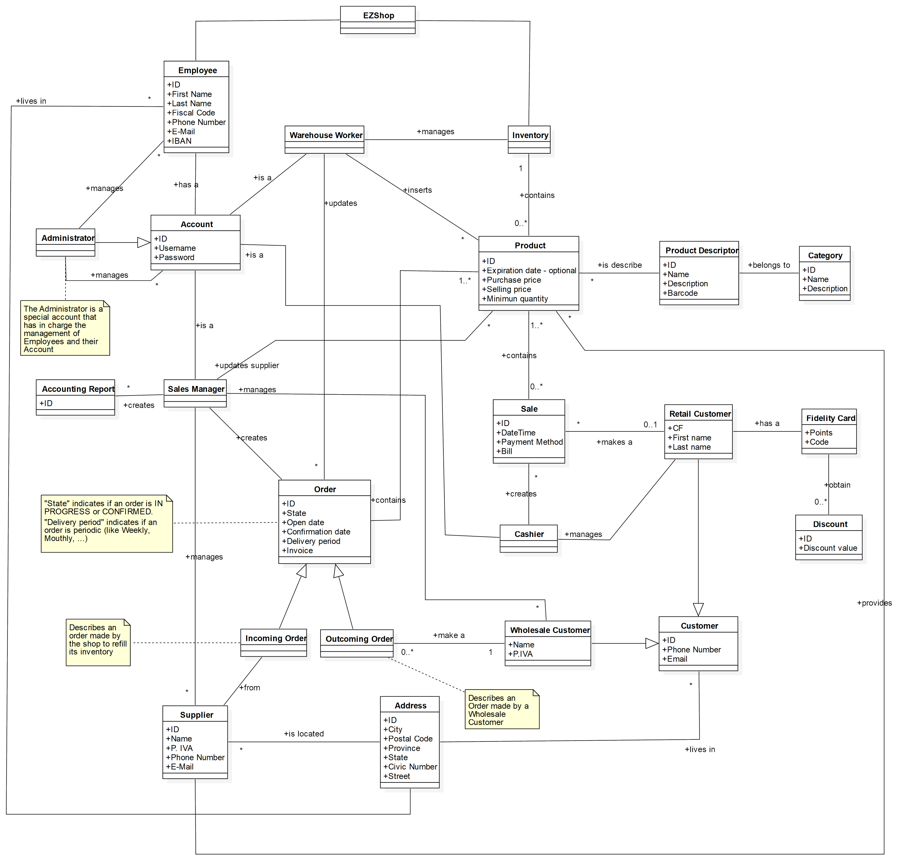

# Requirements Document 

Authors: Biasi Cristina 281936, Cielo Fabio 292464, Guarnieri Enea 	292561, Martini Miriana 283238

Date: 21/04/2021

Version: 1.0

# Contents

- [Essential description](#essential-description)
- [Stakeholders](#stakeholders)
- [Context Diagram and interfaces](#context-diagram-and-interfaces)
	+ [Context Diagram](#context-diagram)
	+ [Interfaces](#interfaces) 
	
- [Stories and personas](#stories-and-personas)
- [Functional and non functional requirements](#functional-and-non-functional-requirements)
	+ [Functional Requirements](#functional-requirements)
	+ [Non functional requirements](#non-functional-requirements)
- [Use case diagram and use cases](#use-case-diagram-and-use-cases)
	+ [Use case diagram](#use-case-diagram)
	+ [Use cases](#use-cases)
    	+ [Relevant scenarios](#relevant-scenarios)
- [Glossary](#glossary)
- [System design](#system-design)
- [Deployment diagram](#deployment-diagram)

# Essential description

Small shops require a simple application to support the owner or manager. A small shop (ex a food shop) occupies 50-200 square meters, sells 500-2000 different item types, has one or a few cash registers 
EZShop is a software system to:
* manage sales
* manage inventory
* manage customers
* support accounting

# Stakeholders

| Stakeholder name  | Description | 
| ----------------- |:-----------:|
|   Owner     |       Hires the employees and funds the system | 
|	Warehouse worker	|	Handles incoming and outgoing products and prepares orders |
|	Sales manager	|	Directly interacts with customers and suppliers, manages sales and takes care of accounting |
|	Cashier	|	Inserts retail sales's transactions and handles the fidelity-card's system |
| Administrator | Creates employees's accounts and manages rights and permissions |
| Customer | Doesn't interact directly with the system. He's the one who wants to buy something |
| Supplier | Doesn't interact directly with the system. Provides the shop the products it needs
| Barcode Reader | Reads barcodes in order to identify products and fidelity-cards | 
| POS | Handles credit card's payments in retail sales |

# Context Diagram and interfaces

## Context Diagram

## Interfaces

| Actor | Logical Interface | Physical Interface  |
| ------------- |:-------------:| -----:|
|   Warehouse worker    | Desktop GUI | Screen, keyboard, mouse on PC |
|	Sales Manager	|	Desktop GUI	|	Screen, keyboard, mouse on PC
| 	Cashier	| Desktop GUI	| Screen, keyboard, mouse on PC
| Administrator | Desktop GUI | Screen, keyboard, mouse on PC
| Barcode Reader | Application as described in https://barcodetopc.com/ | 	Internet connection	|
| POS | SumUp REST API (1.0.0) as described in https://developer.sumup.com/rest-api/#section/Authentication	 | 	Internet connection	|

# Stories and personas

Marco is 54 and has inherited the management of a small grocery store. 
For the shop management he decided to hire employees, supervising their work 
and the progress of the store. As he lives one hour away from the store, 
it's difficult for him to combine his commitments with the store supervision, 
hence he needs to see the progresses and the store's management remotely from his PC.

Gianni is 32 and has been hired as a warehouse worker in a small grocery store.
Working at the inventory, he has to manage all products stocks and incoming/outgoing goods.
He is a tidy man and is happy to have an application that can help him to keep everything in order.
He usually arrives to the store and accesses the platform.
If new orders were created in the previous days, he prepares pallets for deliveries and makes space for the incoming batches.
Based on those orders, he can also update the inventory and monitor all the informations that he needs.

Emma is 42, she has a degree in Economics and Management and is the sale's manager of a small shop in her city. She is the mother of two childern, a 7 and a 9 years old, she is really dynamic and has a great sense of responsability.
She doesn't like to bring the work home, so she needs to optimize the time in the office. She would also like
all the informations about the shop's management to be memorized and accessible from the same place, in order to avoid lots of paper registers and to be more organized.
She is the one who directly interacts with wholesale customers and suppliers, with whom she agrees on the content of the orders and the payment methods, memorizing all the informations and attaching the invoices in the system.
She finds the notification system really useful, as she can easily manage supply of lacking products.
She also periodically checks reports about sales and expenses, to be sure profits are good.

Marta is 19, she is enrolled in the first year of Marketing and Communication degree and she works in a small shop as a cashier. When her boss asked for an idea to improve the shop's sales, she proposed a Fidelity Card system. Marta would find it very useful to manage the registration of a new customer from the cash desk and visualize if a customer has enough Fidelity Points for a discount.

# Functional and non functional requirements

## Functional Requirements

| ID        | Description  |
| ------------- |:-------------:| 
|  FR1     | Manage sales |
|	FR1.1	| Create wholesales |
|	FR1.2	| Create retail sales |
|  FR2  |  Manage inventory |
|  FR2.1  |  Insert a new product, or modify an existing one |
| FR2.2 | Update the available quantity of a product |
| FR2.3 | Delete a product |
|  FR2.4  |  List all products |
| FR2.5 | List a set of products given a filter |
| FR2.6 | Search a product by barcode, code or name |
| FR3  | Manage supplies | 
| FR3.1  |	Notify when the available quantity of a product is not sufficient |
| FR3.2 | Define or modify a supplier for a certain product |
| FR3.3 | Create a supply order |
| FR4  | Manage orders |
| FR4.1 | Modify an order's state |
| FR4.2 | Notify incoming and outgoing orders |
| FR5 | Manage wholesale customers |
| FR5.1 | Insert a new wholesale customer or modify an existing one |
| FR5.2 | Delete a wholesale customer |
| FR5.3 | Search a wholesale customer by code or name |
| FR5.4 | List all orders for a given wholesale customer |
| FR6 | Manage retail customers |
| FR6.1 | Register a new retail customer and activate his fidelity-card |
| FR6.2 | Modify a registered retail customer |
| FR6.3 | Delete a registered retail customer |
| FR6.4 | Update the point balance of a retail customer |
| FR6.5 | Search a retail customer by code or name |
| FR6.6 | List all purchases of a given retail customer |
| FR7 | Manage users |
| FR7.1 | Define a new user, or modify an existing one |
| FR7.2 | Delete a user |
| FR7.3 | Manage user's permissions. Authorize rights and functionalities based on the actor |
| FR8 | Support accounting |
| FR8.1 | Show periodic revenues and expenditures in total and for each customer, supplier and product categories |
| FR8.2 | Show the percentage of growth or fall compared to last month, season or year |

## Access Rights, actor vs function

| Function | Warehouse Worker | Sales Manager | Cashier | Administrator |
| ------------- |:-------------:|:-------------:|:-------------:|:-------------:|  
| FR1.1 | - | X | - | X |
| FR1.2 | - | - | X | X |
| FR2 | X | - | - | X |
| FR3.1 | X | X | - | X | 
| FR3.2 | - | X | - | X |
| FR3.3 | - | X | - | X |
| FR4 | X | X | - | X |
| FR5 | - | X | - | X |
| FR6 | - | - | X | X |
| FR7 | - | - | - | X |
| FR8 | - | X | - | X |

## Non Functional Requirements

| ID        | Type (efficiency, reliability, ..)           | Description  | Refers to |
| ------------- |:-------------| :-----| -----:|
|  NFR1     |  Usability | The system should be understandable by users without a specific training | All FR |
|  NFR2     | Performance | All functions should complete in < 0.5 sec | All FR |
|  NFR3     | Portability | The system should run on every operating system | All FR |
| NFR4 | Privacy | Sensitive data of users should be preserved and private | All FR | 
| NFR5 | Security | Transactions must be encrypted | FR1 |

# Use case diagram and use cases

## Use case diagram

### Use case 1, UC1 - Create new User Account
| Actors Involved        | Administrator  |
| ------------- |:-------------:| 
|  Precondition     | Administrator AD is authenticated |
| | Account A does not exist |  
|  Post condition     | Account A is added in the system with one or more specific roles |
|  Nominal Scenario     | AD hires a new employee, creates an account and selects the role/roles that the new employee will assume in the EZshop |
|  Variants     | - |

#### Scenario 1.1 - Create an account for a new Cashier

| Scenario 1.1 | |
| ------------- |:-------------:| 
| Precondition | Account A does not exist |
| Postcondition | Account A is added in the system with Cashier role |
| Step# | Description |
| 1 | The Administrator AD selects in the system, for account A, the role for which the new user was hired in the shop  |
| 2 | The system associates A to an email and sends a confirmation email |
| 3 | The system waits for confirmation |
| 4 | After receiving it, the system sends user credentials to access A and enters A in the system with the role previously assigned |

### Use case 2, UC2 - Modify User Account
| Actors Involved       | Administrator |
| ------------- |:-------------:| 
|  Precondition     | Administrator AD is authenticated |
| | Account A exists |  
|  Post condition     | - |
|  Nominal Scenario     | AD modifies one or more informations of account A |
|  Variants     | - |

#### Scenario 2.1 - Modify User Account role from Cashier and Warehouse Worker to only Warehouse worker
| Scenario 2.1 | |
| ------------- |:-------------:| 
| Precondition | Administrator is authenticated |
| | Account A exists in the system | 
| Postcondition | Account A is modified in the system with new role |
| Step# | Description |
| 1 | Administrator AD selects in the system the account A |
| 2 | Administrator AD deselects the Cashier role  |
| 3 | The Administrator AD check if the Cashier role is deselected and that the Warehouse worker role is selected, and after that the Administrator AD confirms the modify |
| 4 |The system updates the assignment of the role for account A|

### Use case 3, UC3 - Delete User Account
| Actors Involved        | Administrator |
| ------------- |:-------------:| 
|  Precondition     | Administrator AD is authenticated |
| | Account A exists |  
|  Post condition     | Account A is deleted from the system |
|  Nominal Scenario     | AD selects account A to delete |
|  Variants     | A user can delete only his/her account. AD can delete any account |

#### Scenario 3.1 - Delete an account

| Scenario 3.1 | |
| ------------- |:-------------:| 
| Precondition | The Administrator is authenticated |
| | Account A exists on system |
| Post-condition | Account A is deleted from the system |
| Step # | Description |
| 1 | AD selects A in the system and selects "Delete Account" |
| 2 | The system warns the administrator if he is sure he wants to delete account A and waits for the response |
| 3 | If the answer is confirmatory, the system deletes account A from the system and the access credentials associated |

### Use case 4, UC4 - Manage Wholasale Customer
| Actors Involved        | Sales Manager, Administrator |
| ------------- |:-------------:| 
|  Precondition     | Sales Manager SM is authenticated |
|  Post condition     | - |
|  Nominal Scenario     |  SM can insert a new Wholesale Customer WC and modify or delete an existing one. Furthermore, Sales Manager can search a WC by code or name and list all orders for a given WC. |
|  Variants     | - |

#### Scenario 4.1 -  Search a specific Wholesale Customer by name and list all his orders 

| Scenario 4.1 | |
| ------------- |:-------------:| 
| Precondition | - |
| Postcondition | - |
| Step# | Description |
| 1 | The Sales Manager SM from his account search a Wholesale Customer WC by name |
| 2 | The system find the WC in its archive |
| 3 | SM want to see all orders associated with the WC |
| 4 | The system list all orders associated with the WC |

### Use case 5, UC5 - Create an order for a wholesale customer 

| Actors Involved        | Sales Manager, Administrator |
| ------------- |:-------------:| 
|  Precondition     | Sales Manager SM is authenticated |
| | All products requested exist |  
|  Post condition     | Order O is created and its state is set to "in progress" |
|  | List of products P is attached to order O |
|  | Inventory is updated |
| | Order O is attached to WC |
|  Nominal Scenario     | SM creates a new O for WC including a list of P, providing all needed information |
|  Variants     | - |

#### Scenario 5.1 - Create an order for a new wholesale customer who wants some products delivered every month

| Scenario 5.1 | |
| ------------- |:-------------:| 
| Precondition | Wholesale Customer WC does not exist in the system |
| Postcondition | WC is added to the system |
| | Order O delivery period is set to "monthly" |
| | Inventory is updated |
| Step# | Description |
| 1 | Sales Manager SM creates a new WC providing all his informations |
| 2 | WC is added to the system |
| 3 | SM opens a new order O for wholesale customer W |
| 4 | SM adds all requested product in the desired quantity |
| 5 | SM indicates that the order is scheduled to be delivered every month |
| 6 | SM attaches the bill of the payment |
| 7 | SM confirms the order |
| 8 | O is successfully inserted in the system and attached to WC |
| 9 | The system updates the inventory and programs the order O to be notified for delivery every month |

### Use case 6, UC6 - Define or Update Supplier

| Actors Involved        | Sales Manager, Administrator |
| ------------- |:-------------:| 
|  Precondition     | Sales Manager SM is authenticated |
| | Product P exists |  
| | Supplier S exists |
|  Post condition     | S is set as the supplier for product P |
|  Nominal Scenario     | SM stores in the system the information that P is supplied by S  |
|  Variants     | - |

#### Scenario 6.1 - Update Supplier for a product

| Scenario 6.1 | |
| ------------- |:-------------:| 
| Precondition | Product P is supplied by supplier S1 |
| Postcondition | P is supplied by supplier S2 | Step# | Description |
| 1 | Sales Manager SM selects a product P from the inventory |
| 2 | SM modifies the supplier for P from S1 to S2 |
| 3 | SM confirms the update |
| 4 | The system stores the update in the system |

### Use case 7, UC7 - Create an order for a supplier

| Actors Involved        | Sales Manager, Administrator |
| ------------- |:-------------:| 
|  Precondition     | Sales Manager SM is authenticated |
| | Supplier S exists |  
| | All products P to be supplied exist |
|  Post condition     | Order O is created and its state is set to "pending" |
|  | List of products P is attached to O |
| | O is attached to S |
|  Nominal Scenario     | SM creates a new O for S including a list of products P, providing all needed information |
|  Variants    | - |

#### Scenario 7.1 - Creation of an order for a supplier including products notified to be insufficient

| Scenario 7.1 | |
| ------------- |:-------------:| 
| Precondition | Order O does not exist in the system |
| | Product P's available quantity is below threshold |
| Postcondition | Order O is added to the system |
| Step# | Description |
| 1 | The Sales Manager SM is notified that P's quantity is under threshold |
| 2 | SM creates an O for S of product P, providing all needed information |
| 3 | SM sets the order state to "in progress" |
| 4 | O is added in the system |
| 5 | The system removes the notification for P |

### Use case 8, UC8 - Modify Order's state

| Actors Involved    | Sales Manager, Warehouse Worker, Administrator |
| ------------- |:-------------:| 
|  Precondition     | The actor A is authenticated |
| | Order O exists |  
| | O is attached to Supplier S or Wholesale Customer WC |
|  Post condition     | Order's state is modified to "confirmed" |
|  Nominal Scenario     | A selects an order O, modifies its state and memorizes the current date |
|  Variants    | For an incoming order the inventory is updated once the state turns in "confirmed" |

#### Scenario 8.1 - Modify Order's state for an incoming order

| Scenario 8.1 | |
| ------------- |:-------------:| 
| Precondition | Order state: "pending" |
| Postcondition | Order state: "confirmed" |
| Step# | Description |
| 1 | The actor A searches and selects the Order O to be modified  |
| 2 | A fills the 'Confirmation Date' field with the delivery date at the Store's warehouse |
| 3 | A changes the Order state in "confirmed" |
| 4 | The system acts on the inventory updating quantities for each product P contained in the Order O  |

#### Scenario 8.2 - Modify Order's state for an outgoing order

| Scenario 8.2 | |
| ------------- |:-------------:| 
| Precondition | Order state: "pending" |
| Postcondition | Order state: "confirmed" |
| Step# | Description |
| 1 | The actor A searches and selects the Order O to be modified  |
| 2 | A fills the 'Confirmation Date' field with the departure date from the Store's warehouse |
| 3 | A changes the Order state in "confirmed" |

### Use case 9, UC9 - Support Accounting

| Actors Involved        | Sales Manager, Administrator |
| ------------- |:-------------:| 
|  Precondition     | Sales Manager SM is authenticated |  
|  Post condition     | - |
|  Nominal Scenario     | SM can ask for reports on revenues and expenditures or on the percentage of grow or fall defining a time period and, eventually, some filters. The application computes the request and stores it in the system |
|  Variants    | - |

#### Scenario 9.1 - Show report of revenues and expenditures in the last month for a certain product category 

| Scenario 9.1 | |
| ------------- |:-------------:| 
| Precondition | Product category PC exists |
| | Report R does not exist in the system |
| Postcondition | Report R is added in the system |
| Step# | Description |
| 1 | Sales manager SM specifies as time range the last month |
| 2 | SM specifies a product category PC on which the report should be computed |
| 3 | The application filters all sales and purchases on PC and computes the total earned and the total spent in the last month, presenting the results  |
| 4 | The application stores the report in the system |

### Use case 10, UC10 - Manage Inventory
| Actors Involved        | Warehouse Worker, Administrator |
| ------------- |:-------------:| 
|  Precondition     | Warehouse Worker WW is authenticated |  
|  Post condition     | - |
|  Nominal Scenario     | WW can insert a new Product P and modify or delete an existing one. Furthermore, Warehouse Worker can search a P by code, name or supplier. |
|  Variants     | - |

#### Scenario 10.1 - Insert new product

| Scenario 10.1 | |
| ------------- |:-------------:| 
| Precondition | Product P does not exist in the system |
| Postcondition | P is added in the system |
| Step# | Description |
| 1 | The Warehouse Worker WW inserts all product's information |
| 2 | If P's quantity is known, WW inserts it in the quantity field |
| 3 | The system adds the P in the inventory |

### Use case 11, UC11 - Manage retail customer
| Actors Involved        | Cashier, Administrator |
| ------------- |:-------------:| 
|  Precondition     | Cashier C is authenticated |
|  Post condition     | - |
|  Nominal Scenario     | C lists, create, modify and delete retail customers |
|  Variants     | - |

##### Scenario 11.1 - Create new retail customer

| Scenario 11.1 |  |
| ------------- |:-------------:| 
|  Precondition     | Customer CU do not exist |  
|  Post condition     | CU added in the system |
| Step#        | Description  |
|  1     | The Cashier CA inserts all CU's information |  
|  2     | CA insert the code of the Fidelity Card that will be delivered to the CU |
| 3 | The system set balance point to 0 |

### Use case 12, UC12 - Create a retail sale
| Actors Involved        | Cashier, Barcode reader, POS, Administrator |
| ------------- |:-------------:| 
|  Precondition     | Cashier CA is authenticated |
| | Retail Sale RS does not exist |  
|  Post condition     | RS is added in the system |
|| Inventory successfully updated |
|  Nominal Scenario    | CA scans with the Barcode Reader each product's barcode  and retrieves price from the system, checks if payment succeeds and closes the sale |
|  Variants     | The Customer CU is registered in the system |

##### Scenario 12.1 - Create a retail sale for an unregistered customer who pays with a credit card.

| Scenario 12.1 |  |
| ------------- |:-------------:| 
|  Precondition     | Customer CU is unregistered |  
|  Post condition     | - |
| Step#        | Description  |
|  1     | The Cashier CA scans the product P barcode |  
|  2     | Through the barcode, the system retrievs correct P's price |
| 3 | CA indicates that all P were scanned |
| 4 | The system computes the total amount of the sale |
|  8     | Through the payment API, the system checks if the money transaction succeed |
| 9 | The system updates inventory and records the sale in the system |

##### Scenario 12.2 - Create a retail sale for a registered customer who has an available discount and pays with a credit card.

| Scenario 12.2 |  |
| ------------- |:-------------:| 
|  Precondition     | Customer CU is registered |  
|  Post condition     | CU's fidelity-card point balance is successfully updated |
| Step#        | Description  |
|  1     | The Cashier CA scans the product P barcode |  
|  2     | Through the barcode, the system retrievs correct product P's price |
| 3 | CA indicates that all P were scanned |
| 4 | The system computes the total amount of the sale |
| 5 | CA scans the CU's fidelity-card code |
| 6 | The system checks if the CU has enough points for a discount |
| 7 | Based on discount value, the system decreases the total amount |
|  8     | Through the payment API, the system checks if the money transaction succeed |
| 9 | The system updates inventory, CU's fidelity-card point balance and records the sale in the system |

##### Scenario 12.3 - Create a retail sale for a registered customer who wants to remove a product, does not have enough points for a discount and pays via cash.

| Scenario 12.3 |  |
| ------------- |:-------------:| 
|  Precondition     | Customer CU is registered |
|  Post condition     | CU's fidelity-card point balance successfully updated |
| Step#        | Description  |
| 1 | The Cashier CA scans the product P's barcode |  
| 2 | Through the barcode, the system gets correct P's price |
| 3 | CA indicates that all products were scanned |
| 4 | The system computes the total amount of the sale |
| 5 | CU wants to remove a certain product |
| 6 | CA scans the barcode of the product that wants to remove |
| 7 | The system removes the product and recomputes the total amount |
| 8 | CU pays via cash |
| 9 | CA indicates that the money transaction succeed |
| 10 | The system updates inventory, CU's fidelity-card point balance and inserts the sale in the system |

# Glossary

# System Design

Not relevant in this particular situation, since EZshop needs only software components.

# Deployment Diagram 

Client-server architecture. The EzShop system runs on a server and the client is a desktop system.

