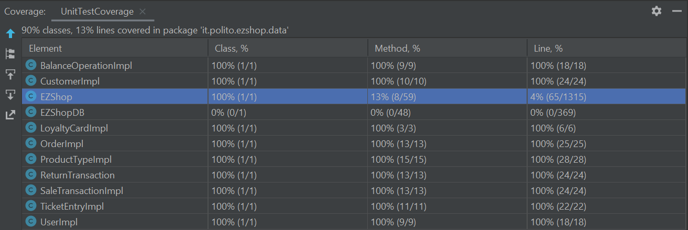

# Unit Testing Documentation

Authors: Biasi Cristina 281936, Cielo Fabio 292464, Guarnieri Enea 	292561, Martini Miriana 283238

Date: 19/05/2021

Version: 1.0

Version 2.0 - 12/06/2021
Changes in document due to the implementation of Change Request - Add RFID on each product

# Contents

- [Black Box Unit Tests](#black-box-unit-tests)

- [White Box Unit Tests](#white-box-unit-tests)

# Black Box Unit Tests

### **Class *EZShop* - method *validRFID***

**Criteria for method *validRFID*:**

 - Number of characters
 - Type of characters
 - Sign of RFID

**Predicates for method *validRFID*:**

| Criteria             | Predicate      |
| -------------------- | -------------- |
| Number of characters | = 12           |
|                      | =! 12          |
| Type of characters   | All digits     |
|                      | Not all digits |
| Sign of RFID         | > 0            |
|                      | <= 0           |

**Boundaries**:

| Criteria             | Boundary values |
| -------------------- | --------------- |
| Number of characters | null String     |

**Combination of predicates**:

| Number of characters | Type of characters | Sign of RFID | Valid / Invalid | Description of the test case                                 | JUnit test case      |
| -------------------- | ------------------ | ------------ | --------------- | ------------------------------------------------------------ | -------------------- |
| null String          | *                  | *            | Invalid         | validRFID(null) -> false                                     | testNullRFID()       |
| != 12                | *                  | *            | Invalid         | validRFID("") -> false validRFID("00000010") -> false validRFID("00000010000001") -> false | testRFIDLength()     |
| *                    | Not all digits     | *            | Invalid         | validRFID("abc000001000") -> false                           | testWellFormedRFID() |
| *                    | *                  | <= 0         | Invalid         | validRFID("-00000001000") -> false validRFID("000000000000") -> false | testPositiveRFID()   |
| = 12                 | All digits         | > 0          | Valid           | validRFID("000000001000") -> true                            | testPositiveRFID()   |

### **Class *EZShop* - method *validBarcode***

**Criteria for method *validBarcode*:**
	

 - Number of characters
 - Type of characters
 - Valid barcode

**Predicates for method *validBarcode*:**

| Criteria | Predicate |
| -------- | --------- |
| Number of characters         |    [0, 12)       |
|          |  [12, 14]         |
|          |    [15, maxInt)       |
|    Type of characters      |      All digits     |
|          | Not all digits |
|     Valid barcode     |   Yes |
| | No |

**Boundaries**:

| Criteria | Boundary values |
| -------- | --------------- |
|      Number of characters    |    null String             |

**Combination of predicates**:

| Number of characters | Type of characters | Valid barcode | Valid / Invalid | Description of the test case | JUnit test case |
|-------|-------|-------|-------|-------|-------|
|  null String | * | * | Invalid | validBarcode(null) -> false | testNullBarcode() |
| [0, 12)    |  *  |  *  |  Invalid  | validBarcode("") -> false validBarcode("40170725") -> false  | testBarcodeLength()  |
|[15, maxInt) | * | * | Invalid | validBarcode("990000100000001862") -> false| testBarcodeLength() |
| * | Not all digits | *  | Invalid | validBarcode("8a02453123024") -> false | testWellFormedBarcode()  |
| * | * | No | Invalid | validBarcode("8002453123023") -> false| testValidBarcode()  |
|[12, 14] | All digits | Yes | Valid | validBarcode("8002453123024") -> true | testValidBarcode() |

### **Class *EZShop* - method *checkCustomerCard***

**Criteria for method *checkCustomerCard*:**
	

 - Number of characters
 - Type of characters

**Predicates for method *Predicates for checkCustomerCard*:**

| Criteria             | Predicate      |
| -------------------- | -------------- |
| Number of characters | [0, 10)        |
|                      | 10             |
|                      | (10, maxInt)   |
| Type of characters   | All digits     |
|                      | Not all digits |

**Boundaries**:

| Criteria             | Boundary values |
| -------------------- | --------------- |
| Number of characters | null            |

**Combination of predicates**:

| Number of characters | Type of characters | Valid / Invalid | Description of the test case | JUnit test case |
|-------|-------|-------|-------|-------|
|[0, 10)|*|Invalid|T1(null) -> FALSE T2("1a12sc") -> FALSE T3("") -> FALSE|testNull() testShortMixed() testEmpty()|
|(10, maxInt)|*|Invalid|T4("123asd456asd") -> FALSE|testLongMixed()|
|10|Not all digits|Invalid|T5("a123456789") -> FALSE|testMixed()|
|10|All digits|Valid|T6("1234567890") -> TRUE|testCorrect()|

 ### **Class *EZShop* - method *validPosition*** 

**Criteria for method *validPosition*:**
	

 - Number of fields
 - Separator
 - Fields type
 - Sign of fields
 - Well formed fields

**Predicates for method *name*:**

| Criteria | Predicate |
| -------- | --------- |
|    Number of fields      |     ==3      |
|          |       !=3    |
|    Separator   |      -     |
|          |    not -       |
|   Fields type       |    number (aisle, level) alphabetic (rack)       |
|          |     not number (aisle, level) not alphabetic (rack)      |
|      Sign of fields    |    <=0       |
|  Well formed fields |  Yes |
|   |  No |

**Combination of predicates**:

| Number of fields | Separator | Fields type  | Sign of fields  | Well formed fields | Valid / Invalid | Description of the test case | JUnit test case |
|-------|-------|-------|-------|-------|-------|-------|-------|
| != 3   |  * | *  | *  | * | Invalid | validPosition("12-A") -> false | testPositionNumberOfFields() |
| *   |  not - | *  | *  | * | Invalid | validPosition("12-A,18") -> false | testPositionSeparator() |
| *   |  * | not number aisle not alphabetic rack not number level  | *  | * | Invalid | validPosition("G-A-18") -> false validPosition("12-4-18") -> false validPosition("12-A-dieci") -> false | testPositionFieldType() |
| *   |  * | *  | <= 0 | * | Invalid | validPosition("-12-A-18") -> false validPosition("12-A-0") -> false | testPositionFieldSign() |
| *  |  * | *  | *  | No | Invalid | validPosition("0012-A-18") -> false validPosition("12-Aaa-18") -> false validPosition("12-A-00018") -> false | testPositionWellFormed() |
| == 3   |  - | number aisle alphabetic rack number level | > 0 | Yes | Valid | validPosition("12-A-18") -> true | testValidPosition() |

### **Class *EZShop* - method *checkLuhn***

**Criteria for method *checkLuhn*:**
	

 - Length
 - Well formed
 - Valid

**Predicates for method *checkLuhn*:**

| Criteria | Predicate |
| -------- | --------- |
|    Length     |    == 16       |
|          |    != 16       |
|   Well formed       |     Yes      |
|          |      No     |
| Valid | Yes |
| | No |

**Boundaries**:

| Criteria | Boundary values |
| -------- | --------------- |
|    Lenght      |       null String          |

**Combination of predicates**:

| Length | Well formed | Valid | Valid / Invalid | Description of the test case | JUnit test case |
|-------|-------|-------|-------|-------|-------|
| null | * | * | Invalid | checkLuhn(null) ->false | testNullLuhn |
| != 16 | * | * | Invalid | checkLuhn("") -> false checkLuhn("49927398716") ->false checkLuhn("374652346956782346957823694857692364857368475368") ->false| testLuhnLength |
| * | No | * |Invalid | checkLuhn("123456g812y45670") -> false| testWellFormedLuhn| |
| * | * | No | Invalid|checkLuhn("1234567812345678") -> false | testvalidLuhn|
| == 16 | Yes |Yes|Valid|checkLuhn("1234567812345670") -> true|testvalidLuhn|

### **Class *EZShop* - method *getCreditCards***

**Criteria for method *getCreditCards*:**
	

 - Empty
 - Found

**Predicates for method *getCreditCards*:**

| Criteria | Predicate |
| -------- | --------- |
|   Empty     |    Yes       |
|          |    No       |
| Found | Yes |
| | No |

**Boundaries**:

| Criteria | Boundary values |
| -------- | --------------- |
|    Empty      |       null String          |

**Combination of predicates**:

| Empty |Found | Valid / Invalid | Description of the test case | JUnit test case |
|-------|-------|-------|-------|-------|
| null | * | Invalid | T1(null) -> false | testNullGetCreditCard |
| Yes | * | Invalid | T2("") -> false | testEmptyGetCreditCard |
| * | No |Invalid | T3("1234567812345670") -> false| testCreditCardNotFound| |
| No | Yes| Valid | T4("5100293991053009") -> true | testCreditCardFound|

# White Box Unit Tests

### Test cases definition

| Unit name | JUnit test case |
|----|----|
| ProductType | TestProductType *method* testProductType()|
| User | TestUser *method* testUser() |
| Order | TestOrder *method* testOrder() |
| Customer | TestCustomer *method* testCustomer() |
| LoyaltyCard | TestLoyaltyCard *method* testLoyaltyCard() |
| SaleTransaction | TestSaleTransaction *method* testSaleTransaction() |
| TicketEntry | TestTicketEntry *method* testTicketEntry() |
| ReturnTransaction | TestReturnTransaction *method* testReturnTransaction() |
| BalanceOperation | TestBalanceOperation *method* testBalanceOperation() |
| Product | TestProduct *method* testProduct() |
| EZShop.validBarcode | TestBarcode *methods* - testNullBarcode() - testBarcodeLength() - testWellFormedBarcode() - testValidBarcode() |
| EZShop.checkCustomerCard | TestLoyaltyCardCode *methods* - testNull() - testEmpty() - testShortMixed() - testLongMixed() - testMixed() - testCorrect() |
| EZShop.CheckLuhn EZShop.getCreditCards | TestCreditCard *methods* -testNullLuhn()  -TestLuhnLength  -testWellFormedLuhn()  -testValidLuhn()  -testNullGetCreditCard()  -testEmptyGetCreditCard() -testCreditCardNotFound() -testCreditCardFound() |
| EZShop.validPosition | TestPosition *methods* - testPositionNumberOfFields() - testPositionSeparator() - testPositionFieldType() - testPositionFieldSign() - testPositionWellFormed() - testValidPosition() |
| EZShop.validRFID | TestValidRFID *methods* - testNullRFID() - testRFIDLength() - testWellFormedRFID() - testPositiveRFID() |

### Code coverage report

### Loop coverage analysis

    <Identify significant loops in the units and reports the test cases
    developed to cover zero, one or multiple iterations >

|Unit name | Loop rows | Number of iterations | JUnit test case |
|---|---|---|---|
| EZShop.validBarcode (first loop) | 1 | >1 | testValidBarcode()|
| EZShop.validBarcode (second loop) | 1 | >1 | testValidBarcode()|
|EZShop.checkLuhn |6| >1| testValidLuhn()|
|EZShop.getCreditCards |6| >1| testCreditCardFound()|
||||||

